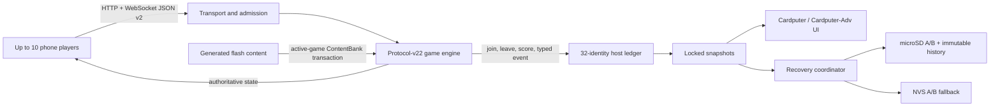

# Architecture

Hotspot Arcade Cardputer is one authoritative game engine surrounded by bounded
transport, host-mirror, persistence, and presentation adapters. Phones never mutate
game state directly: they send intents, the engine validates them, and it emits the
only state clients render.

## Five modules

### 1. Runtime and transport

`hotspot-arcade-cardputer.ino`, `ha_device.h`, `ha_network_policy.h`, and
`ha_runtime_types.h` own runtime board classification, the Wi-Fi AP, captive
DNS/HTTP server, WebSocket callbacks, client admission, rate limits, flow control,
and the loop scheduler.

One compiled image supports two explicit M5Unified identities: `M5Cardputer`
(numeric board ID 14) and `M5CardputerADV` (numeric board ID 24). The pure
`ha_device.h` classifier is covered by native tests, while compile-time assertions
bind those numeric contracts to the locked M5Unified declarations. Startup records
the detected identity in diagnostics and prints it to serial. Any other identity
enters the fatal startup screen before network initialization or OTA health
confirmation; there is no permissive unknown-board fallback.

The allocation-free socket table admits at most ten authenticated players and two
pending handshakes. Pending sockets have a five-second hello deadline. Twelve
WebSocket objects are retained so a duplicate identity can bind its new socket before
the old one closes; an unauthenticated arrival never evicts an authenticated player.

Outbound pressure is handled per client:

- At queue depth four, replaceable snapshots are coalesced.
- At depth eight, stream traffic such as Draw ink and Pong state is dropped.
- At sixteen queued control messages, only that overloaded client is closed.
- A dirty authoritative snapshot is retried after the queue drains.

Inbound token buckets are 12/s burst 24 for general control, 35/s burst 10 for Draw,
one per 750 ms burst three for chat, and one per 300 ms burst four for emoji.

### 2. Engine and host mirror

The engine in `vendor/engine/` owns game rules, per-game phone scores, player seats,
challenges, matches, timers, and browser protocol v2. It derives a 128-bit stable
identity from each browser-only resume token and never emits the raw token.

The Cardputer build fixes the engine at exactly ten players and five simultaneous
matches for every 1v1 implementation: the shared duel games, Pong, Battleship, and
Chess. Compile-time assertions bind those values to the ten-station softAP limit so
an upstream default cannot silently change the device contract. The current registry
contains 20 games with IDs 1 through 20, but consumers treat IDs as sparse keys and
derive support, labels, and display order from `tools/content-manifest.json` rather
than from a numeric range.

`ha_host.h` maps the engine's PID-oriented sinks to a 32-entry cumulative identity
ledger. Each record stores the digest, nickname, avatar, signed saturating session
score, online/current-PID state, and sparse game-play counts. `ha_event_format.h`
turns the bounded typed event protocol into the 24-entry localized, scrollable host
log. Protocol v22 removes the former generic event and round-result callbacks in
favor of that semantic sink. The separate host-directed finished-art stream is
discarded by the Cardputer adapter rather than becoming an alternate history input;
the corresponding bounded `fdart` WebSocket picture still reaches phones. The typed
log is also in-memory only and is not part of a checkpoint or archive.

### 3. Content

`tools/content-manifest.json` is the explicit list of accepted games, locales, packs,
and web assets. `tools/gen-assets.mjs` validates paths, UTF-8 byte counts, duplicate
routes, pack syntax, and gzip assets, then creates deterministic flash-resident data
and UI metadata. The manifest is authoritative for the sparse game registry and for
the locale fallback graph: both `de` and `pt-br` fall back to `en` when the active
game has no pack set in the requested language. Locale-specific availability may
differ, and selection happens once for the whole game; translated and English packs
are never mixed within one bank. Accordingly, Spectrum's v22 Wild Card pack remains
English-only rather than being inserted into the German or Portuguese-Brazil banks.
The generated gzip web payload is capped at 72 KiB total; generation fails above
that ceiling.

`ha_content.h` loads only the target game's content. At most one typed `ContentBank`
is live and one replacement bank is staged. A transaction begins with the target
game and requested locale, selects that game's complete translated pack set or its
explicit English fallback as a unit, loads packs and items, verifies exact 16-bit
counts and type-specific bounds, then commits. Packless games use an empty typed
bank. Commit resets the target game to its lobby, broadcasts the requested locale,
and emits one authoritative state without exposing an intermediate empty lobby. A
locale-only reload preserves that game's phone scores; a game change resets them.
Any allocation, parse, count, or validation failure aborts the staged bank and leaves
the prior game, bank, locale, round, and scores live.

Content allocations prefer external PSRAM, then make one internal-heap fallback.
Every content `String` mutation and the final commit are guarded by a 64 KiB internal
memory reserve so Wi-Fi, AsyncTCP, and direct-draw UI fallback retain working space.
Game selection remains a Cardputer loop-task operation because it reads flash-backed
packs; phone game-change proposals are answered `policy_denied` and never mutate the
active game or bank.

### 4. Recovery

`ha_config.h`, `ha_active_nvs.h`, and `ha_history.h` use bounded records and CRC-32.
Config records are limited to 2 KiB, active/archive records to 8 KiB, lines to 256
bytes, and participants to 32. Text is validated UTF-8 and percent-encoded.

Config and active state alternate between A/B slots. A write targets the older slot,
flushes, reopens, parses, and CRC-verifies it; the previous valid slot remains. At
boot, the highest valid generation across SD and NVS wins, with SD winning ties. The
active state is coalesced for one second on SD and 30 seconds in no-SD NVS mode, and
is forced before AP changes, restore, or New Session.

Archives are immutable `S%08u.ha` records installed through a verified temporary
file and rename. `index.bin` is a CRC-protected cache that can always be rebuilt by
scanning archives. Legacy `config.txt`, `current.txt`, and `history.txt` imports are
idempotent; originals become `.v1.imported` only after verified promotion.

Durable records contain the selected game ID and sparse game-play counters, but not
engine PIDs, phone scores, current rounds, host-directed finished art, or the typed
host-event ring. Recovery therefore restores cumulative identity state and loads one
fresh active-game bank into a new lobby.

### 5. Host presentation

`ha_ui.h` draws the dashboard, game picker, cumulative leaderboard, history browser,
event log, settings, confirmations, and diagnostics. The normal canvas is 8-bit; if
allocation fails the same UI draws directly. Rendering uses a locked mirror snapshot
and performs display work after releasing the engine mutex.

`ha_async_queue.h` is a bounded multi-producer queue used by asynchronous sinks to
request loop-task work such as sounds. Async callbacks never touch the display,
speaker, SD, DNS, or AP lifecycle directly.

## Time and disconnect semantics

The engine advances a rollover-safe logical clock from raw ESP time. Planned
transport downtime freezes this clock, every game deadline, disconnect expiry,
quorum reconciliation, and live matches. A normal disconnect is narrower:

- The seat and exact game state remain reserved for 120 seconds.
- Offline players do not satisfy ordinary party quorum and cannot be challenged.
- An affected 1v1 match or role-critical Drawing, Spectrum, KMK, Fill the Blank,
  Werewolf, Spyfall, or Draw a Monster round pauses.
- Expiry performs game-specific leave/forfeit exactly once and releases the PID.
- The host identity/score ledger remains after PID expiry.

The 120-second rule is only for an unplanned, transient socket disconnect while the
AP keeps running. AP lifecycle states are `Booting`, `Running`, `ManualOff`, and
`ReconnectWait`. Rename/off first announces pause and forces a checkpoint. Manual-off
is indefinite. A planned restart instead gives the captured required identities ten
minutes to return, resumes automatically when they do, or accepts host resume/end.
The planned pause freezes the logical and disconnect clocks, so it does not consume
the ordinary two-minute grace. At actual shutdown, the adapter atomically detaches
all engine socket ownership, disables new callback admission, clears its bounded
socket/queue mirrors, and only then starts asynchronous WebSocket/server/AP teardown.
Delayed disconnect callbacks therefore cannot leak stale online seats into the first
post-restart snapshot. A failed rename restores the prior SSID.

## Concurrency and I/O rules

The engine, host ledger, socket policy state, session transaction flags, and mirror
share one recursive FreeRTOS mutex. Every critical section is represented by an
engine guard and records its maximum hold time. UI and persistence receive copies,
then operate without the engine lock. In particular, no SD, display, speaker, AP,
DNS, HTTP lifecycle, or blocking persistence work is permitted under the mutex.

The loop performs at most one queued sound request per tick and ends with a one-tick
yield. Diagnostics expose the runtime model and board ID, free/minimum heap, largest
block, socket/queue high-water marks, rate rejections, coalesces/drops/closes, loop
gaps, mutex hold time, SD failures, sound drops, and checkpoint generation.

## Boot and OTA health

Startup first classifies the detected M5 board and refuses unsupported hardware. It
then allocates the recursive mutex and bounded storage/UI buffers, loads and repairs
configuration, mounts SD or degrades to NVS, recovers the active session, loads
content, installs handlers, forces the initial checkpoint, starts AP/DNS/HTTP, and
draws a healthy screen. Only then does it mark a pending OTA image valid. A fatal
board or initialization error displays a failure and deliberately leaves rollback
pending; SD failure alone is degraded operation rather than a fatal boot.

## Provenance and release boundary

`tools/sync-upstream.mjs` copies only committed objects from the reviewed upstream
URL and 40-character commit. `UPSTREAM.lock.json` records every file hash and a
source-tree digest. The downstream build lock records every tool, Arduino dependency,
archive, and `boot_app0.bin` hash.

The universal image uses the tagged M5GFX 0.2.26 archive plus one exact upstream
fix hunk from M5GFX PR #233, commit
`5f8a783f7dbc07e8ce5c19cf8779829d1eefcde1`. This prevents a VAMeter I2C probe from
overwriting the GPIO result needed to distinguish Cardputer-Adv when G5/G6 are
pulled high. Bootstrap installs the tagged library, verifies the target preimage,
applies the staged patch, and verifies the patched result against the lock; it does
not substitute the full M5GFX development branch. The SPDX document represents the
reviewed change as a separate MIT-licensed source package with a `PATCH_FOR`
relationship to M5GFX 0.2.26.

A release candidate is accepted only after native sanitizer tests, simulator tests,
a clean generated-file check, firmware budgets, two isolated clean-cache builds with
identical outputs, esptool reconstruction, deterministic packaging, SPDX validation,
checksums, provenance verification, and the physical matrix for both supported
devices. Its manifest declares `singleImage: true` and enumerates both runtime board
IDs. M5Burner catalog identity and publication are deferred from this hardware
qualification phase; producing the deterministic archive does not publish or prove
device compatibility. Final GitHub publication is independent of that deferral:
the M5 job is an exact repository-variable opt-in, while candidates never publish.
An enabled M5 failure leaves the GitHub release in draft form. Enabling the job
requires a new Kaini-owned firmware ID; the legacy public ID must not be reused.
