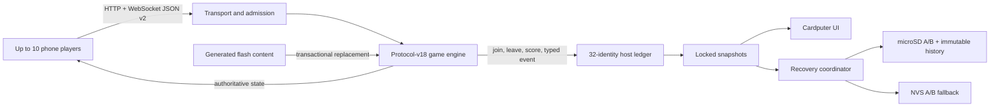

# Architecture

Hotspot Arcade Cardputer is one authoritative game engine surrounded by bounded
transport, host-mirror, persistence, and presentation adapters. Phones never mutate
game state directly: they send intents, the engine validates them, and it emits the
only state clients render.

## Five modules

### 1. Runtime and transport

`hotspot-arcade-cardputer.ino`, `ha_network_policy.h`, and `ha_runtime_types.h`
own the Wi-Fi AP, captive DNS/HTTP server, WebSocket callbacks, client admission,
rate limits, flow control, and the loop scheduler.

The allocation-free socket table admits at most ten authenticated players and two
pending handshakes. Pending sockets have a five-second hello deadline. Twelve
WebSocket objects are retained so a duplicate identity can bind its new socket before
the old one closes; an unauthenticated arrival never evicts an authenticated player.

Outbound pressure is handled per client:

- At queue depth four, replaceable snapshots are coalesced.
- At depth eight, stream traffic such as Draw ink and Pong state is dropped.
- At sixteen queued control messages, only that overloaded client is closed.
- A dirty authoritative snapshot is retried after the queue drains.

Inbound token buckets are 12/s burst 24 for general control, 35/s burst 10 for Draw,
one per 750 ms burst three for chat, and one per 300 ms burst four for emoji.

### 2. Engine and host mirror

The engine in `vendor/engine/` owns game rules, per-game phone scores, player seats,
challenges, matches, timers, and browser protocol v2. It derives a 128-bit stable
identity from each browser-only resume token and never emits the raw token.

`ha_host.h` maps the engine's PID-oriented sinks to a 32-entry cumulative identity
ledger. Each record stores the digest, nickname, avatar, signed saturating session
score, online/current-PID state, and sparse game-play counts. `ha_event_format.h`
turns the bounded typed event protocol into the 24-entry scrollable host log.

### 3. Content

`tools/content-manifest.json` is the explicit list of accepted games, locales, packs,
and web assets. `tools/gen-assets.mjs` validates paths, UTF-8 byte counts, duplicate
routes, pack syntax, and gzip assets, then creates deterministic flash-resident data
and UI metadata.

`ha_content.h` replaces content as a transaction: begin staging, load every pack,
set the pending locale, verify accepted pack/item counts, commit, return the selected
game to its lobby, broadcast configuration, and emit one authoritative state. Failure
keeps the prior content and locale live.

### 4. Recovery

`ha_config.h`, `ha_active_nvs.h`, and `ha_history.h` use bounded records and CRC-32.
Config records are limited to 2 KiB, active/archive records to 8 KiB, lines to 256
bytes, and participants to 32. Text is validated UTF-8 and percent-encoded.

Config and active state alternate between A/B slots. A write targets the older slot,
flushes, reopens, parses, and CRC-verifies it; the previous valid slot remains. At
boot, the highest valid generation across SD and NVS wins, with SD winning ties. The
active state is coalesced for one second on SD and 30 seconds in no-SD NVS mode, and
is forced before AP changes, restore, or New Session.

Archives are immutable `S%08u.ha` records installed through a verified temporary
file and rename. `index.bin` is a CRC-protected cache that can always be rebuilt by
scanning archives. Legacy `config.txt`, `current.txt`, and `history.txt` imports are
idempotent; originals become `.v1.imported` only after verified promotion.

### 5. Host presentation

`ha_ui.h` draws the dashboard, game picker, cumulative leaderboard, history browser,
event log, settings, confirmations, and diagnostics. The normal canvas is 8-bit; if
allocation fails the same UI draws directly. Rendering uses a locked mirror snapshot
and performs display work after releasing the engine mutex.

`ha_async_queue.h` is a bounded multi-producer queue used by asynchronous sinks to
request loop-task work such as sounds. Async callbacks never touch the display,
speaker, SD, DNS, or AP lifecycle directly.

## Time and disconnect semantics

The engine advances a rollover-safe logical clock from raw ESP time. Planned
transport downtime freezes this clock, every game deadline, disconnect expiry,
quorum reconciliation, and live matches. A normal disconnect is narrower:

- The seat and exact game state remain reserved for 120 seconds.
- Offline players do not satisfy ordinary party quorum and cannot be challenged.
- An affected 1v1 match or role-critical Draw/Spectrum/KMK round pauses.
- Expiry performs game-specific leave/forfeit exactly once and releases the PID.
- The host identity/score ledger remains after PID expiry.

AP lifecycle states are `Booting`, `Running`, `ManualOff`, and `ReconnectWait`.
Rename/off first announces pause and forces a checkpoint. Manual-off is indefinite.
Restart allows ten minutes for required identities, resumes automatically when they
return, or accepts host resume/end. A failed rename restores the prior SSID.

## Concurrency and I/O rules

The engine, host ledger, socket policy state, session transaction flags, and mirror
share one recursive FreeRTOS mutex. Every critical section is represented by an
engine guard and records its maximum hold time. UI and persistence receive copies,
then operate without the engine lock. In particular, no SD, display, speaker, AP,
DNS, HTTP lifecycle, or blocking persistence work is permitted under the mutex.

The loop performs at most one queued sound request per tick and ends with a one-tick
yield. Diagnostics expose free/minimum heap, largest block, socket/queue high-water
marks, rate rejections, coalesces/drops/closes, loop gaps, mutex hold time, SD
failures, sound drops, and checkpoint generation.

## Boot and OTA health

Startup allocates the recursive mutex and bounded storage/UI buffers, loads and
repairs configuration, mounts SD or degrades to NVS, recovers the active session,
loads content, installs handlers, forces the initial checkpoint, starts AP/DNS/HTTP,
and draws a healthy screen. Only then does it mark a pending OTA image valid. A fatal
initialization error displays a failure and deliberately leaves rollback pending; SD
failure alone is degraded operation rather than a fatal boot.

## Provenance and release boundary

`tools/sync-upstream.mjs` copies only committed objects from the reviewed upstream
URL and 40-character commit. `UPSTREAM.lock.json` records every file hash and a
source-tree digest. The downstream build lock records every tool, Arduino dependency,
archive, and `boot_app0.bin` hash.

A release candidate is accepted only after native sanitizer tests, simulator tests,
a clean generated-file check, the firmware budgets, two clean-cache isolated identical builds,
esptool reconstruction, deterministic M5 packaging, SPDX validation, checksums, and
provenance verification. Final metadata additionally requires the release tag to
resolve to the clean packaged commit; M5Burner receives that exact commit as an
independent publication constraint.
